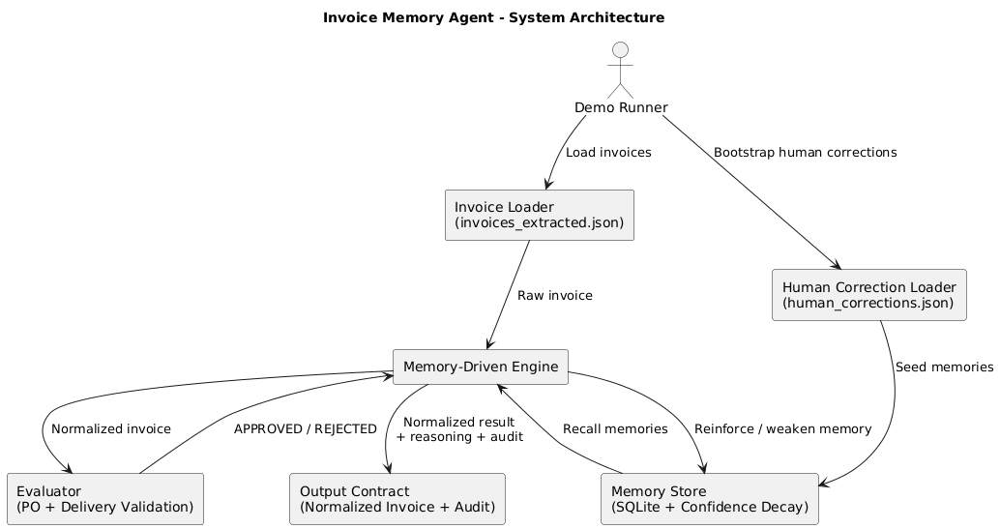

# 🧠 Invoice Memory Agent
### Memory-Driven Invoice Normalization & Learning System

---

## 📌 Overview

**Invoice Memory Agent** is an AI-inspired, memory-driven system that processes invoices by learning from past human corrections rather than re-processing each invoice as an isolated event.

Instead of relying solely on static rules or retraining ML models, the system:
* **Remembers** vendor-specific correction patterns.
* **Assigns** confidence scores to learned memories.
* **Automatically applies** trusted corrections.
* **Escalates** uncertain cases for human review.
* **Continuously learns** and improves over time.

This design closely mirrors how human analysts learn patterns, making the system safer, explainable, and production-ready.

---
## 🧠 Design Principles

This system was designed around the following core principles:

1. **Safety First**
   - No correction is auto-applied unless it crosses a confidence threshold.
   - Low-confidence behavior is explicitly escalated for human review.

2. **Learning Without Retraining**
   - Avoids costly ML retraining cycles.
   - Learns incrementally from real operational feedback.

3. **Explainability by Default**
   - Every decision is backed by memory, confidence, and reasoning.
   - Fully auditable with structured logs and traceable memory updates.

4. **Human Authority Preservation**
   - Humans remain the ultimate decision-makers.
   - The system assists, never overrides human judgment.

5. **Production Readiness**
   - Deterministic outputs.
   - Stateless engine + persistent memory store.
   - Easy to extend, debug, and audit.


## 🎯 Key Problem Addressed

Traditional invoice processing systems often suffer from:
1.  **Repeated manual corrections** for the same recurring errors.
2.  **No learning** from past human decisions.
3.  **Unsafe automation** without confidence-based guardrails.
4.  **Lack of explainability** and audit trails.

This project solves these issues using a **memory-based learning architecture**.

---

## 🧩 Core Concepts Implemented

### 1️⃣ Learned Memory (Not Retraining)
The system does not require expensive model retraining. It stores human-approved correction patterns as "memories."
* **Vendor Context:** Memories are specific to the issuer.
* **Pattern Matching:** e.g., mapping `Leistungsdatum` → `serviceDate`.
* **Confidence Scores:** Based on approval/rejection counters.
* **Time Decay:** Older, unused memories lose influence.

### 2️⃣ Confidence-Guided Decision Policy
Every correction proposal carries a confidence score to determine the level of automation.

| Confidence Range | Action Taken by System | Rationale |
| :--- | :--- | :--- |
| **High (≥ threshold)** | **Auto-apply correction** | Memory has strong historical validation. |
| **Medium** | **Require human review** | Prevent unsafe or premature automation. |
| **Low** | **Skip correction** | Insufficient evidence to trust memory. |

### 3️⃣ Human-in-the-Loop (HITL)
* **Reinforcement:** Human approvals strengthen a memory's weight.
* **Correction:** Human rejections weaken memory confidence.
* **Progressive Trust:** Confidence grows gradually to ensure reliability.

### 4️⃣ Memory Decay (Forgetting Mechanism)
To mimic human behavior and maintain system hygiene, memories decay over time if they aren't reinforced. This prevents outdated business rules from becoming permanent.

### 5️⃣ Ground-Truth Evaluation Layer
The **Evaluator** validates invoices against external data (Purchase Orders/Delivery Notes):
* Acts as an automated "senior reviewer."
* Provides the final "Ground Truth" to feed back into the learning loop.

---
## 🏗️ System Architecture


---
## 🔄 Engine Lifecycle (Step-by-Step)

The system follows a linear, four-stage loop to ensure safe and predictable processing.

> ### 🔹 Step 1: Recall
> * **Fetch** vendor-specific memories from the database.
> * **Apply** confidence decay to account for memory age.
> * **Summarize** recalled patterns for the current context.

> ### 🔹 Step 2: Apply
> * **Match** retrieved memories against the raw invoice content.
> * **Generate** proposed corrections.
> * **Safe State:** No mutation occurs yet (Safe Suggestion Phase).

> ### 🔹 Step 3: Decide
> * **Deduplicate** corrections (always prioritizing the highest confidence).
> * **Auto-apply** only those corrections that exceed the trust threshold.
> * **Flag** low-confidence or ambiguous cases for manual human review.

> ### 🔹 Step 4: Learn
> * **Update** memory confidence based on the final approval or rejection.
> * **Persist** the refined patterns back to the **SQLite** store.
> * **Audit:** Log the learning action for transparency and reporting.
 ---
 ## 🚨 What Makes This System Different

Unlike traditional invoice automation systems, this project:

| Traditional Systems | Invoice Memory Agent |
|---------------------|---------------------|
| Static rules | Adaptive memory-based learning |
| Blind automation | Confidence-aware decisions |
| Retraining required | Zero retraining |
| Black-box logic | Fully explainable |
| No forgetting | Time-based memory decay |
| Error-prone scaling | Vendor-specific learning |

This approach mirrors how experienced finance analysts learn patterns over time — making it both safer and more effective in real-world operations.

 ---
 ## ⚠️ Failure Handling & Edge Cases

The system explicitly handles the following scenarios:

- **Cold Start**:  
  No memories → no automation → safe suggestions only.

- **Incorrect Automation**:  
  Human rejection aggressively weakens memory confidence.

- **Conflicting Memories**:  
  Highest-confidence memory wins (deduplication step).

- **Stale Knowledge**:  
  Memory confidence decays over time if not reinforced.

- **Duplicate Invoices**:  
  Potential duplicates are flagged to prevent contradictory learning.

This ensures the system degrades safely instead of failing silently.
---
## 📊 Operational Metrics (Trackable)

The following metrics can be derived directly from the system:

- Automation Rate (% auto-applied corrections)
- Human Review Rate
- Memory Confidence Distribution
- Memory Decay Frequency
- False Positive / False Negative Rates (via evaluator)

These metrics enable continuous monitoring and safe rollout.
---
## 🧾 Compliance & Audit Readiness

The system is designed for audit-heavy financial environments:

- Every correction is traceable to a specific memory
- Every decision includes reasoning and confidence
- Full audit trail with timestamps for recall, decision, and learning
- No silent data mutation or irreversible automation

This makes the system suitable for regulated enterprise workflows.
---
## 📁 Repository Structure

```text
src/
 ├── engine.ts               # Core recall-apply-decide-learn logic
 ├── memoryStore.ts          # SQLite-based memory persistence
 ├── evaluator.ts            # Ground-truth validation layer
 ├── humanCorrectionLoader.ts# Bootstraps memory from human data
 ├── demoRunner.ts           # End-to-end demo execution
 └── types.ts                # Shared type contracts

data/
 ├── invoices_extracted.json
 ├── reference_data.json
 └── human_corrections.json
```
---
## 🧪 Demo & Testing
###  Run Demo
```bash
npx ts-node --transpile-only src/demoRunner.ts
```
## The demo simulates:

* **Cold-start invoice**: Processing when no prior memory exists.

* **Human correction bootstrapping**: Initial learning from manual inputs.

* **Memory recall**: Applying learned patterns to subsequent invoices.

* **Evaluator feedback loops**: Real-time confidence updates based on outcomes.
---
## 📤 Output 

The system guarantees a deterministic JSON output for every invoice:

```json
{
  "normalizedInvoice": {},
  "proposedCorrections": [],
  "requiresHumanReview": true,
  "reasoning": "...",
  "confidenceScore": 0.0,
  "memoryUpdates": [],
  "auditTrail": []
}
```
## 🚀 Future Extensions
* **Vector Similarity**: Using embeddings for fuzzy pattern matching.

* **Vendor Clustering**: Sharing "general knowledge" between similar vendors.

* **UI Workflow**: A dedicated dashboard for human reviewers.

* **LLM Reasoning**: Using Generative AI to explain why a memory was formed.


